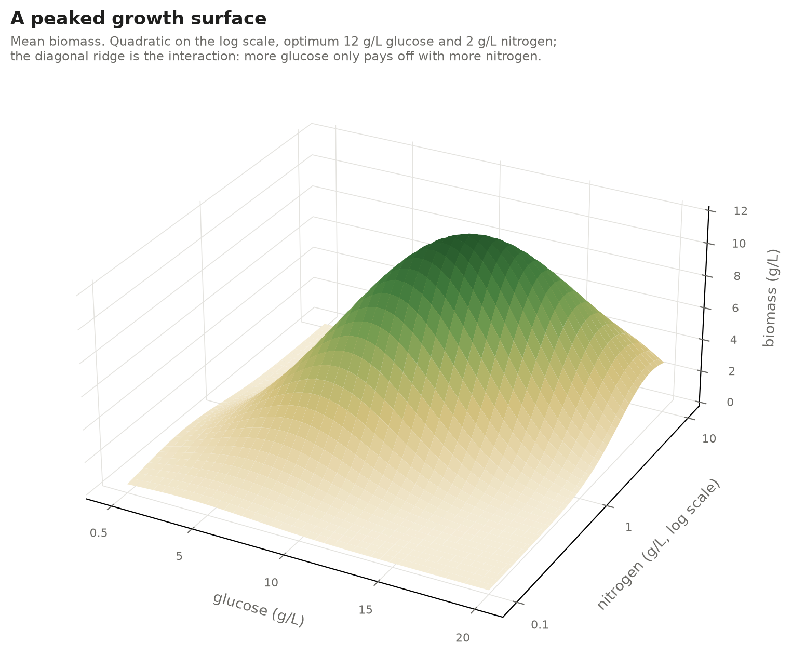

# malt🌾

**M**edia **A**ctive-**L**earning **T**oolkit.


*Simulated campaigns over glucose, nitrogen and phosphate, 20 per panel, each
starting from the same 17-run design around a house medium and adding 16 runs a
round. Every run a campaign chooses adds its regret, the share of the best
achievable biomass it gave up, so the curves count optimal runs' worth of
biomass lost; a campaign that learns bends away from a straight line. Lines
are the mean over the 20 campaigns and the bands are 90% confidence intervals
for that mean, not the spread of single campaigns. Left, the true surface is a
single peak, quadratic in log biomass; right, it is a GP draw no quadratic
fits. Iterative RSM is the classical workflow:
least squares on a quadratic, then a central composite design around its
predicted optimum each round. Regenerate with `python -m benchmarks.three_factor.regret`.*

**TL;DR:** malt picks which media compositions to test next, so a campaign
reaches its best biomass in fewer rounds than iterative response-surface
methodology would take. It fits a Bayesian Gamma model to your growth data,
which keeps predictions positive and lets noise scale with yield, then proposes
the batch where that model is least certain or most promising. Nothing reaches the lab until a person approves the
batch. The model, the campaign and its acquisition rules exist; the state store
and the agent-facing tools come next.

malt characterizes how cell cultures respond to their media, using Bayesian
modeling and active learning to get there in fewer experiments than a fixed
design would need.

The classical approach is design of experiments and response surface
methodology (Montgomery, *Design and Analysis of Experiments*): ordinary least
squares on linear, quadratic, and interaction terms. OLS carries a Gaussian
likelihood, whose support runs from negative to positive infinity. Growth is
bounded below by zero, so that likelihood puts mass where no measurement can
land and predicts negative biomass near the edges of a design. malt fits a
Gamma likelihood instead, which has support on the positive reals and lets
variance grow with the mean the way these assays do.

The second departure is what happens after a round finishes. Rather than
committing to one design up front, malt fits what you have measured, works out
where the response surface is least known, and proposes the next batch from
there.

## Status

Early. What exists:

- `malt.engine.factors` declares the variables a campaign may vary and their ranges
- `malt.engine.glm` fits a Gamma/log-link response surface and reports whether the sampler converged
- `malt.active_learning` defines the campaign: the interfaces its actors implement, the campaign that runs them, a journal that records each round, rules for when to stop, and the batch acquisition rules
- `malt.simulation.oracle` simulates an environment with a known ground truth, for testing the campaign without a lab
- `malt.simulation.regret` scores campaigns against that ground truth; `python -m benchmarks.three_factor.regret` runs the comparison

Simulated campaigns run end to end. The batch-effect model, the state store,
and the MCP server come next.

## Install

malt needs Python 3.12 or newer and uses [uv](https://docs.astral.sh/uv/). It
isn't on PyPI yet, so add it to your project from GitHub:

```bash
uv add git+https://github.com/tremgan/malt.git
```

To work on malt itself, clone it and let uv build the environment, dev tools
included:

```bash
git clone https://github.com/tremgan/malt.git
cd malt
uv sync
uv run pytest
```

## The active-learning campaign

A campaign has four actors, defined in `malt.active_learning.actors`:

- a **surrogate model**: what the campaign currently believes about the response surface
- an **acquisition** rule: how it picks the next experiments given that belief
- an **experimenter**: the two together, the thing that decides what to run
- an **environment**: whatever runs the experiments, simulated or real

The surrogate model, acquisition rule and environment are abstract base
classes: an implementation subclasses one and fills in its abstract methods.
The experimenter is a concrete class that holds one surrogate and one rule.

One round goes: the experimenter proposes a batch, the environment runs it, and
the experimenter updates its belief on what came back.

The surrogate is a distribution over response surfaces. Before it has seen data
it is the prior, and `condition(data)` returns the posterior as a new model,
leaving the old one untouched. `sample(x)` returns joint draws of the mean
response at `x`, one row per draw, and the same row is the same surface on every
call. Thompson sampling depends on that: it picks each draw's best point, which
only means something if the whole row comes from one surface.

An acquisition rule returns the next batch. Every rule is handed the current
model, but only model-driven rules (expected improvement, UCB, Thompson) use
it; random sampling and a fixed design ignore it. That shared interface is what
lets a Bayesian-optimization campaign and an iterative DOE campaign run through
the same code and be compared on equal terms.

### Running a campaign

```python
from malt.active_learning.actors import Experimenter
from malt.active_learning.campaign import run_campaign
from malt.active_learning.termination import MaxRoundsRule, UnreliableFitRule

experimenter = Experimenter(surrogate_model=..., acquisition=...)

journal = run_campaign(
    experimenter,
    environment,
    seed_data,            # the experiments you start from
    n=8,                  # batch size
    random_seed=0,
    termination_rule=UnreliableFitRule() | MaxRoundsRule(k=12),
)
```

The acquisition rules live in `malt.active_learning.acquisitions`:

- `QNoisyExpectedImprovement(factors)` picks the batch one point at a time,
  each maximizing the batch's expected improvement over the best result so far.
  It spreads the batch over competing hypotheses about where the peak is.
- `QUpperConfidenceBound(factors, beta)` does the same for an upper
  confidence bound; `beta` sets how much it favours uncertain regions.
- `ThompsonSampling(factors)` takes the best point of one plausible surface
  per batch slot.
- `CentralComposite(factors)` places a central composite design
  around the model's current best guess: iterative response-surface
  methodology.

Two baselines ignore the model: `RandomBatch(factors)`, uniform on every axis
and the floor any rule must beat, and `FixedDesign(factors, design)`, which runs a design chosen up
front (a Box-Behnken or CCD over the full ranges) the way most labs do.

None of them searches a fixed grid. The model-driven rules score a fresh set
of space-filling points each round and find the model's best guess by
continuous optimization, so no lattice limits how close to the optimum a
campaign can get. Log-scale factors are covered evenly in log space.

The seed is not a round. It is the data a campaign starts from, usually a
Box-Behnken or similar design, or historical runs, and a benchmark gives every
experimenter the same one.

`run_campaign` takes one termination rule, checked before every round. Rules
combine with `&` and `|` into a new rule, so a target is capped by `|`-ing it
with `MaxRoundsRule`; the example above stops early if a fit fails its
convergence gate. The default is ten rounds.

`run_campaign` returns a `LabJournal` holding each round's data and the model
fitted after it. The same `random_seed` reproduces a simulated campaign
exactly, and gives two experimenters the same measurement noise, so benchmark
arms are compared on equal terms.

## Simulated environments

`malt.simulation.oracle.Oracle` stands in for the lab. It pairs a latent function,
the true surface on the link scale, with a likelihood that turns it into noisy
measurements:

```python
from malt.simulation.oracle import GammaLikelihood, Oracle

environment = Oracle(latent=true_surface, likelihood=GammaLikelihood(alpha=20))
environment.query(x, rng)   # noisy measurements, as a lab would return them
environment.mean(x)         # the ground truth, which a lab never gives you
```

`GammaLikelihood` draws from the same family the model fits, so a test isolates
inference from model misspecification. `GaussianLikelihood` is there for the
identity-link case. To simulate a misspecified campaign, change the surface, not
the likelihood.

`quadratic_latent` is a single peak in coded units, set by where the optimum is,
how high it is, and how sharply it falls away; off-diagonal curvature tilts it.
It is the shape a growth response is expected to have near an optimum, and
exactly the family the Gamma GLM fits. This is one
(`docs/figures/quadratic_oracle.py`):



*Synthetic, but shaped like real media responses: each nutrient helps until
excess inhibits growth, so there is one optimum inside the range, and the best
glucose level shifts with nitrogen, the way carbon-to-nitrogen balance does in
real cultures.*

```python
from malt.simulation.oracle import GammaLikelihood, Oracle, quadratic_latent

latent = quadratic_latent(
    factors,
    optimum={"glucose": 12.0, "nitrogen": 2.0},
    peak=np.log(12.0),
    curvature=[[3.4, -2.2], [-2.2, 3.4]],
)
environment = Oracle(latent, GammaLikelihood(alpha=20))
```

For a surface nobody wrote by hand, `gp_sampled_latent` draws one from a
Gaussian process with an RBF kernel, fixed once drawn, so you can query it
anywhere. Lengthscale is
measured in coded units, so it means the same thing on a linear factor and a log
one. No quadratic fits such a surface exactly, which makes it a fair test of how
the models cope with a truth outside their family.

```python
latent = gp_sampled_latent(factors, rng, lengthscale=0.6, sd=0.5, mean=np.log(4.0))
```

`docs/figures/gp_oracle.py` renders one.

## Fitting a model

Your data is one row per run, a column per factor in real units, and a column
for what you measured:

```
   glucose  nitrogen  phosphate  biomass
0      0.1      0.50       0.55    0.584
1      0.1      4.00       0.55    1.077
2     10.0      0.50       0.55    1.507
3     10.0      4.00       0.55   10.112
4      0.1      2.25       0.10    0.560
```

Declare what each column means, then fit:

```python
from malt.engine.factors import Factor
from malt.engine.glm import fit_gamma_glm

factors = [
    Factor("glucose", 0.1, 10.0, units="g/L", scale="log"),
    Factor("nitrogen", 0.5, 4.0, units="g/L"),
    Factor("phosphate", 0.1, 1.0, units="g/L"),
]

fit = fit_gamma_glm(runs, response="biomass", factors=factors, random_seed=0)

print(fit.convergence.summary())                                  # converged
print(fit.posterior["posterior"]["beta"].mean(("chain", "draw"))) # the surface
```

```
glucose               0.72     glucose^2            -0.65
nitrogen              0.54     nitrogen^2           -0.24
phosphate             0.25     phosphate^2          -0.50
                               glucose:nitrogen      0.30
```

Every factor gets a linear term, a squared term, and one interaction per pair.
Three factors make nine coefficients plus an intercept, so ten runs is the
floor before a fit means anything. `fit_gamma_glm` refuses fewer.

Negative squared terms are the interesting ones. Each says the response peaks
inside the range you declared rather than running off an edge, which is what
makes an optimum worth searching for. Read one directly with
`fit.posterior["posterior"]["beta"].sel(term="glucose^2")`.

### Defining and sampling separately

`fit_gamma_glm` wraps two steps. Defining a model costs milliseconds and
sampling it costs seconds, so split them when you want to see the
specification before paying for a posterior:

```python
import pymc as pm
from malt.engine.glm import build_gamma_glm, sample_gamma_glm

glm = build_gamma_glm(runs, response="biomass", factors=factors)
pm.sample_prior_predictive(draws=200, model=glm.model)   # do the priors make sense?
fit = sample_gamma_glm(glm, random_seed=0)
```

Arguments follow the split. `alpha_prior_sigma` shapes the model, while
`draws`, `chains`, `target_accept` and `random_seed` shape the sampling.

## Why the log link

The intro covers the Gamma likelihood. The link deserves its own note.

A log link makes the coefficients multiplicative: doubling glucose scales
biomass by a factor rather than adding a fixed amount, which is how media
components behave. It also pairs with the Gamma to hold the coefficient of
variation constant, so a run yielding 10 g/L carries proportionally more
absolute noise than one yielding 1. Fit those on a Gaussian and the
high-yield runs look like outliers, so the model chases them.

One consequence worth knowing: the posterior over the mean is lognormal
shaped, not normal. Closed-form Gaussian formulas for expected improvement do
not apply, so the acquisition functions will compute by Monte Carlo over the
draws instead.

## Why coded units, not z-scores

`Factor.encode` maps each value to `[-1, +1]` against the range you declared.
It does not standardize against the observed data, and the difference matters
twice.

Empirical means and standard deviations move as a campaign progresses. Round
one spreads across the whole space; round four clusters near an optimum. If the
scaling follows the data, a coefficient from round one and a coefficient from
round four are measured in different units, and the prior on the quadratic
terms silently becomes a different prior each round.

The second reason applies to any factor you declare as `scale="log"`. Glucose
from 0.1 to 10 g/L has design levels at 0.1, 1, and 10. Z-scoring those
arithmetically puts them at -0.658, -0.493, and 1.151, which crushes two of the
three levels together and leaves the curvature estimated from almost nothing.
Encoding in log space puts them back at -1, 0, and +1. On a simulated fit that
change moved effective sample size from 1113 to 3740 and cut mean coefficient
error by half.

## Convergence

Every fit returns a `ConvergenceReport` next to the draws. The gate is zero
divergences, r-hat below 1.01, and at least 1000 effective samples in both bulk
and tail.

```python
fit.convergence.converged   # False if any gate failed
fit.convergence.failures    # ("max r_hat 1.526 >= 1.01", ...)
```

A failed fit still comes back, because the diverged draws are what you need to
work out why. `fit_gamma_glm` raises a `ConvergenceWarning` so a person notices
and sets `converged=False` so a program can.

Tail effective sample size is gated alongside bulk because the acquisition
functions read the upper tail of the posterior. A chain can mix well through
the middle of a distribution and still wander in the tail, which would move the
recommended next experiment for no reason but sampler noise.
