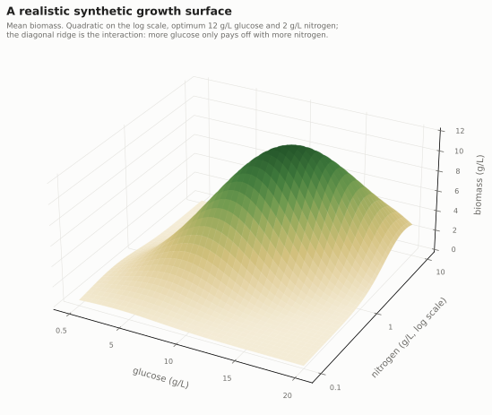
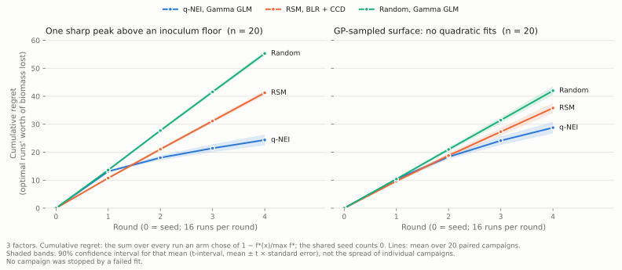
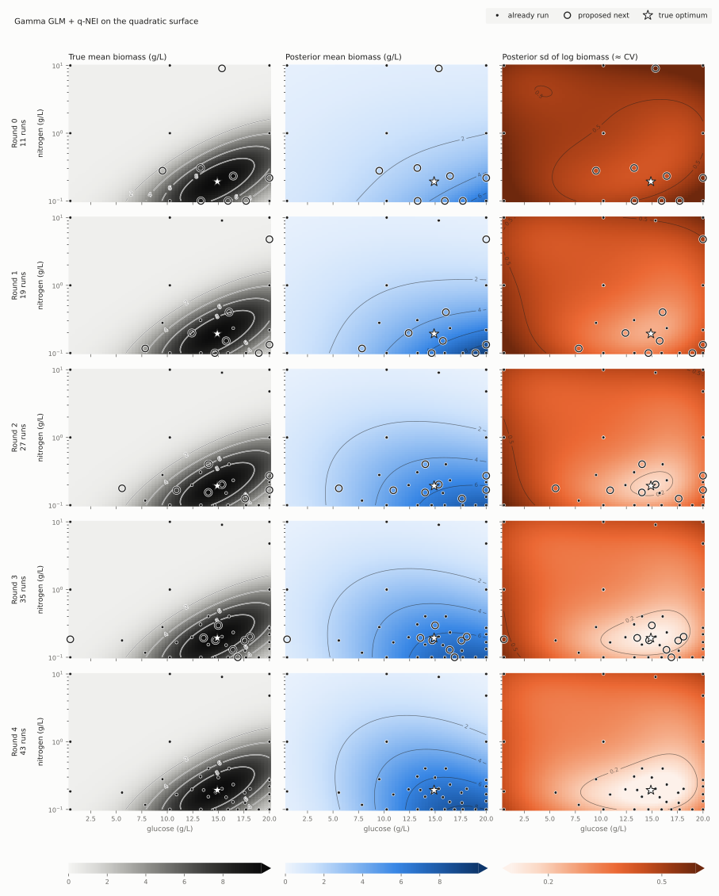
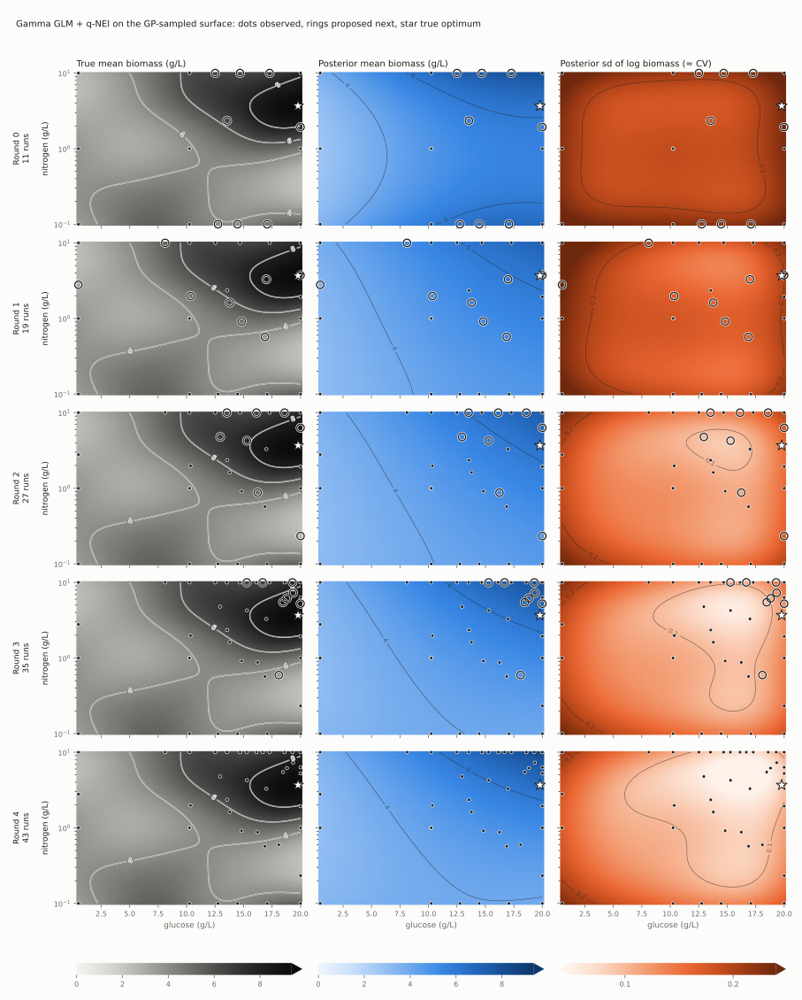

# malt🌾

**M**edia **A**ctive-**L**earning **T**oolkit.

malt picks which media compositions to test next. It fits a Bayesian Gamma GLM
model to growth data (not Gaussian since growth is bounded from below by 0) and proposes the next batch by Bayesian optimization.

<picture>
  <source media="(prefers-color-scheme: dark)" srcset="docs/figures/quadratic_oracle_dark.svg">
  
</picture>

The problem in two components. Real media have six or eight, the surface is not
this smooth, and every point costs a culture.

Candidates are space-filling draws rather than a grid, redrawn each round, and
q-NEI treats them only as starting points. It then optimizes each pick with
L-BFGS-B on the model's analytic derivative. The gain grows with the number of
components, since a pool of n points covers only n^(1/k) levels per component.
The rule is BoTorch's q-NEI under sequential greedy selection, in numpy over
PyMC's posterior draws, so nothing here depends on torch. UCB and Thompson
sampling still pick from the draws.

**Status:** early and changing fast. Simulated campaigns run end to end; the
state store and the agent-facing tools come next.

## Layout

- `malt.engine`: factors, the Gamma GLM, acquisition maths, continuous search
- `malt.active_learning`: the campaign loop, surrogate models, acquisition rules, stopping rules
- `malt.simulation`: simulated labs with a known truth, and regret scoring
- `benchmarks/`: benchmark scripts and their results

## Install

Needs [uv](https://docs.astral.sh/uv/getting-started/installation/)

```bash
git clone https://github.com/tremgan/malt.git
cd malt
uv sync
uv run pytest
```

## Using it in a lab

malt does not talk to your hardware and does not schedule anything. It reads the
runs you have already done and hands back the next batch to run. What happens to
that batch is yours: someone approves it, someone pipettes it, and the results
come back whenever they come back.

```python
import numpy as np
import pandas as pd

from malt.active_learning.acquisitions import QNoisyExpectedImprovement
from malt.active_learning.actors import Experimenter
from malt.active_learning.surrogates import GammaGLMSurrogate
from malt.engine.factors import Factor

FACTORS = (
    Factor("glucose", 1.0, 20.0, units="g/L"),
    Factor("nitrogen", 0.1, 10.0, units="g/L", scale="log"),
)

rng = np.random.default_rng(0)
lab = Experimenter(GammaGLMSurrogate(FACTORS), QNoisyExpectedImprovement(FACTORS))

lab.observe(pd.read_csv("runs.csv"), rng)  # every run you have done so far
if not lab.surrogate_model.reliable:       # the MCMC convergence gate
    raise SystemExit("fit did not converge; do not run this batch")

batch = lab.propose(6, rng)
batch.to_csv("batch_07.csv", index=False)
print(batch.round(2))
```

Starting from 11 runs around a house recipe of about 3 g/L glucose and 0.2 g/L
nitrogen, which yielded 0.04 to 0.45 g/L of biomass:

```
   glucose  nitrogen
0    20.00     10.00
1    14.48     10.00
2    20.00      2.62
3    17.02     10.00
4    11.81     10.00
5    15.26      3.10
```

Several of those sit on a bound, which is the right answer and not a bug: every
run so far has been poor and none has shown where the response turns over, so
the batch leaves the house recipe and probes the top of the allowed range, while
keeping two points back where it suspects the peak already is. `Factor` bounds
are the only thing keeping a proposal inside what you can actually pipette, so
set them to the range you are willing to run.

Once the batch has been run and the biomass typed in, the next round is the same
two calls:

```python
lab.observe(pd.read_csv("batch_07_done.csv"), rng)  # the new rows only
batch = lab.propose(6, rng)
```

```
   glucose  nitrogen
0    16.49      1.96
1    20.00      0.91
2    14.37      2.82
3    15.30      2.32
4    13.52      3.86
5    18.29      1.66
```

Six more runs was enough to see the response turn over, so the second batch
comes off the ceiling and gathers around 15 g/L glucose and 2 to 4 g/L nitrogen.
One point still goes to the glucose bound, because nothing yet rules out more.

`observe` accumulates, so hand it the new rows rather than the whole file again:
re-observing 11 runs it has already seen leaves it twice as sure as it should
be. If you would rather not track which rows are new, throw the `Experimenter`
away and rebuild it from the whole file. Conditioning is associative, so both
routes give the same posterior to the last digit, and there is no state to
recover after a crash beyond the file itself.

### What it needs from you

- **One row per run**, a column per factor plus the readout. Columns it does not
  recognise are ignored, so an existing sheet with operator, date or notes works
  as it is.
- **A strictly positive readout.** The likelihood is Gamma, so zero or negative
  values are refused rather than quietly fitted. Call it `y`, or say which
  column it is with `GammaGLMSurrogate(FACTORS, response="OD600")`.
- **More runs than the model has terms.** A full quadratic over `k` factors has
  `2k + k(k-1)/2` of them, so two factors need at least 6 runs and three need 10.
  Below that, pass `terms=("linear",)` to start first-order and move to the
  quadratic once you have the runs for it. A balanced design fits better than
  the same number of scattered points.
- **Ranges you are willing to pipette**, one `Factor` each. Use `scale="log"` for
  anything spanning an order of magnitude or more: a factor over 0.1 to 10 g/L
  has an arithmetic centre of 5.05 and a geometric one of 1.0, and centre points
  land in very different places depending on which you meant. Historical runs
  from outside the range you declare are still fine to fit on.

## Benchmarks

The regret benchmarks score Bayesian optimization against iterative
response-surface DOE and against random batches, by cumulative regret on a
simulated lab whose optimum is known:

```bash
uv run python -m benchmarks.two_factor.regret --replicates 20 --workers 8
uv run python -m benchmarks.three_factor.regret --replicates 20 --workers 8
```

<picture>
  <source media="(prefers-color-scheme: dark)" srcset="benchmarks/three_factor/results/regret_dark.svg">
  
</picture>

Three factors, 16 runs a round, 20 paired campaigns per arm. q-NEI starts level
with random in the first round, when it has only the seed to go on, then
flattens to about 0.19 of a run's biomass lost per run on the quadratic surface
while random stays near 0.86. Crossing model against acquisition on the
two-factor benchmark puts that gap in the acquisition rather than the Gamma GLM:
swapping q-NEI for a central composite costs a median 5.7 to 8.7 regret with
either model, while swapping the model moves it by at most 2.6, and by under 0.1
in half the cells.

Both baselines are iterative. A one-shot Box-Behnken or CCD, which is what a lab
would more often run, is not in the benchmark yet, so nothing here yet supports
"fewer experiments than a fixed design".

What the campaign is doing between those numbers, round by round. Two factors
here so the surface can be drawn; each row is one round, showing the truth, what
the model believes, and where it is still unsure.

<picture>
  <source media="(prefers-color-scheme: dark)" srcset="benchmarks/two_factor/results/rounds_qnei_quadratic_dark.svg">
  
</picture>

```bash
uv run python -m benchmarks.two_factor.rounds --arm qnei --surface quadratic
```

On the quadratic surface the model is in family, and the seed alone is not
enough: after 11 runs the posterior mean is a broad gradient and uncertainty is
high nearly everywhere. By round 2 the ridge is in the right place and
uncertainty has collapsed into an island around the optimum. The far corner
stays dark to the end, because nothing out there would change the answer.

The GP-sampled surface is the harder case. No quadratic fits it, so the
posterior mean stays a smooth approximation of a surface that is not smooth, and
the campaign is still descending at round 4 rather than converged:

<picture>
  <source media="(prefers-color-scheme: dark)" srcset="benchmarks/two_factor/results/rounds_qnei_gp_dark.svg">
  
</picture>

```bash
uv run python -m benchmarks.two_factor.rounds --arm qnei --surface gp
```

`ablation` crosses the model against the acquisition, so the gap above can be
attributed to one or the other:

```bash
uv run python -m benchmarks.two_factor.ablation --replicates 20 --workers 8
```

## Planned

None of this exists yet.

**A state store, and an MCP server over it.** The agent-facing tools are meant to
be the primary interface, with a human checkpoint wired into the data rather than
into somebody's discipline: a batch is written `proposed`, and only a person moves
it to `approved`. Nothing in the repo will make that transition on its own. Every
tool call has to be resumable, so an agent picking up a campaign after a restart
can reconstruct where things stand from the store alone. Today that state is
whatever CSV you keep.

**Batch effects.** Runs done in one session share an operator, a media lot and a
cell state, and pretending otherwise attributes session-to-session variation to
the media composition. The plan is a random intercept per batch, which is also
why a batch carries an ID from proposal through results rather than being
flattened into one long frame. The part that matters is what the acquisition
then sees: for a batch that has not been run yet, its offset is itself unknown,
so the uncertainty has to integrate over that variance instead of using the
fixed effects alone. Getting that wrong understates uncertainty everywhere and
produces no error.

**Execution through [PyLabRobot](https://github.com/pylabrobot/pylabrobot).** A
hardware-agnostic layer for liquid handlers, so an approved batch could become a
protocol a deck actually runs, and the results could come back without being
retyped. Note where the boundary sits: malt would emit a batch and PyLabRobot
would execute one that a human has already approved. The approval does not become
a function call, and nothing in `engine` or `active_learning` will reach for a
robot.


